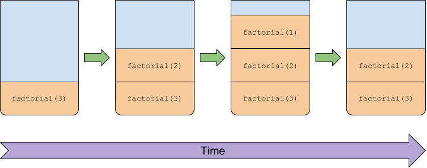

# Stacks
## Phillips Academy CSC630: Data Structures and Algorithms, Spring 2017
##### Created March 26, 2017
##### Author: Nicholas Zufelt

In this project, we'll be working with stacks. This project will have multiple tasks, much of which should be completable in parallel.  

1. Create a `Stack` data structure with the API outlined below.
2. Create a multithreaded application `Inspector` that can run the methods of a compiled class and create a linked list of stacks of method names as a result.
3. Create a class `MethodReport` that can take a linked list of stacks of method names and determine if a method is recursive (including branching or linear).

## A `Stack` data structure
Your stack data structure should implement the following methods.  Feel free to make your `Stack` class a subclass of your `LinkedList` class, if that's what makes sense.

* A no-args constructor
* `public boolean empty()` -- Tests if this stack is empty.
* `public T peek()` -- Looks at the object at the top of this stack without removing it from the stack.
* `public T pop()` -- Removes the object at the top of this stack and returns that object as the value of this function.
* `public T push(T item)` -- Pushes an item onto the top of this stack.
* `public int search(Object o)` -- Returns the 1-based position where an object is on this stack. If the object o occurs as an item in this stack, this method returns the distance from the top of the stack of the occurrence nearest the top of the stack; the topmost item on the stack is considered to be at distance 1. The equals method is used to compare o to the items in this stack.
* `public String toString()` -- Returns an attractive printout of the whole stack.  (Note that this cannot be completed with the public API, unless you make a copy of the stack.  No need to stick to only public methods for this implementation!)

## `Inspector` class
Create a class `Inspector` that can take a compiled Java class, inspect it for what methods it has, and then "test run" all methods for which this is possible.  If a given method takes parameters that are primitive types or Class-type objects (_i.e._ not a primitive type) for which you have a constructor, call the method, possibly with a few options for its parameters.  If the given method can't reasonably be inspected, your `Inspector` should skip that method.

The `Inspector` class should have two public methods:
* `public ArrayList<MethodReport> InspectAll()` -- Inspect all methods and build a `MethodReport` for each method that it can
* A `main` method that ties this lab together -- if I run the command `java Inspector myCompiledCode.class`, I should get a nice-looking printout that lists all the methods that it can, and whether they are non-recursive, branched or linearly recursive.

#### Some hints for the `Inspector` class
* Check out the `mwe` folder for some minimal working examples on making multiple threads that can view each other's stack traces, and an example on viewing the methods of a class.
* You can probably only see the public methods of a class.  That's fine!
* Create a bunch of test classes to test your `Inspector` on.  Create a separate `test` folder with the source code (not the compiled code) for these test classes.
* You might get some benefit by calling the methods of the class with multiple options while testing if each method is recursive.

## `MethodReport` Class
Create a class `MethodReport` which has:
* a field `String methodName` (as well as an accessor for such a field) -- The name of the method inspected.
* a number of fields `LinkedList<Stack<String>> timeline` (or an array of them if needed) -- the call stacks of the method calls through time when this method is called.  You should only add a new `Stack<String>` when your `Inspector` determines that the call stack has changed (no repeats).  For example, if the inspected method is linearly recursive (say, it's `factorial(int n)`), then the `timeline` should be of the form:

 

 The `String`s  that I'm referring to within the `Stack`s will probably need to be a possibly-cleaned-up version of the outputs of a call to `getStackTrace` or `getAllStackTraces` (see `mwe` for some minimal working examples).

* an accessor `getTimeline` -- this isn't strictly necessary, but will help both you and me test your code.
* `public boolean isRecursive()` -- Return `true` if the method is recursive (branched or otherwise).
* `public boolean isBranchedRecursive()` -- Return `true` if the method is branched recursive (_i.e._ not linearly recursive).

#### Some hints for the `MethodReport` class
* It does not count as recursive if you're calling a different method, such as `Math.sqrt`.  It may be difficult to detect private, recursive helper methods; see what you can do.
* This can absolutely be done in parallel to the development of the `Inspector` class --- just come up with some examples!

## Important security note
Running mystery code from unknown sources is a dangerous decision.  It wouldn't take someone long to come up with some Java code that does some serious damage to your computer, compile it, and then send it off to you to determine if it's recursive or not.  This is just to say: the code you write for this project is for _learning purposes only_, and probably shouldn't be used in any kind of production system where you aren't 100% sure of the code you're running.
